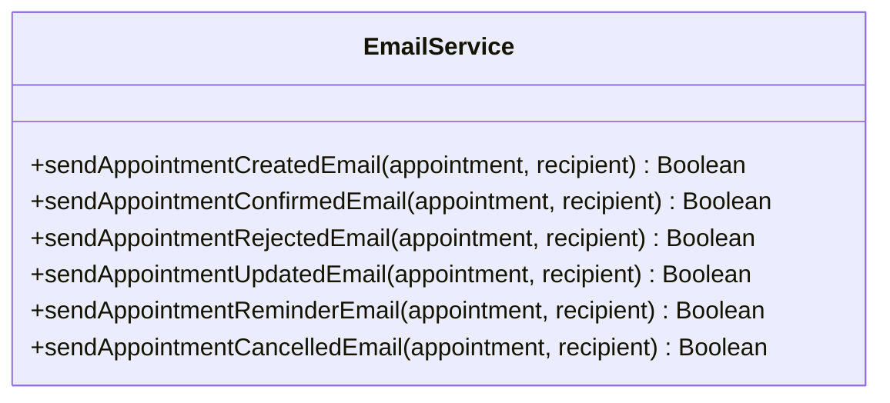
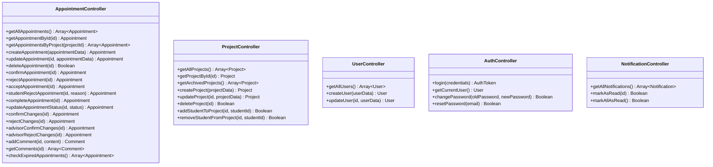
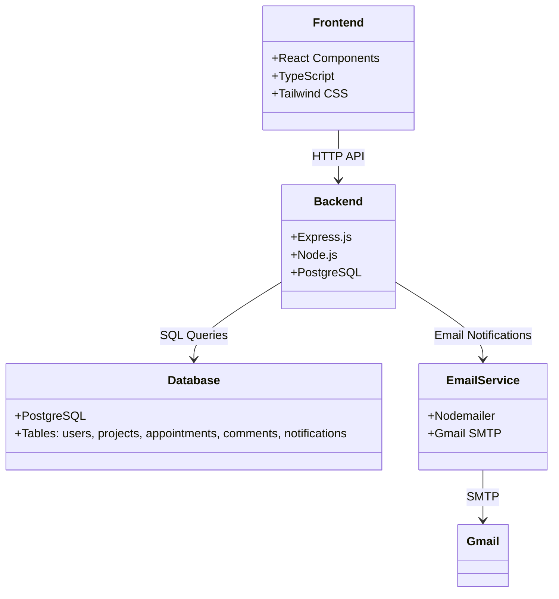

# Class Diagram - ระบบจัดการนัดหมาย (UML Notation)

## 🏗️ Database Entity Classes

```mermaid
classDiagram
    class User {
        +Integer id
        +String student_id
        +String first_name
        +String last_name
        +String phone
        +String email
        +String office
        +String role
        +String password_hash
        +Timestamp created_at
        +Timestamp updated_at
    }

    class Project {
        +Integer id
        +String name
        +Integer advisor_id
        +Timestamp created_at
        +Timestamp updated_at
    }

    class ProjectStudent {
        +Integer project_id
        +Integer student_id
        +Timestamp created_at
    }

    class Appointment {
        +Integer id
        +String title
        +Date date
        +Time time
        +String location
        +String notes
        +String status
        +Integer student_id
        +Integer advisor_id
        +Integer project_id
        +Timestamp created_at
        +Timestamp updated_at
    }

    class Comment {
        +Integer id
        +String content
        +Integer appointment_id
        +Integer user_id
        +Timestamp created_at
    }

    class Notification {
        +Integer id
        +Integer user_id
        +String type
        +String title
        +String message
        +Boolean is_read
        +Integer appointment_id
        +Integer related_id
        +Timestamp created_at
    }

    %% Relationships
    User ||--o{ Project : "advisor_id"
    User ||--o{ ProjectStudent : "student_id"
    Project ||--o{ ProjectStudent : "project_id"
    User ||--o{ Appointment : "student_id"
    User ||--o{ Appointment : "advisor_id"
    Project ||--o{ Appointment : "project_id"
    Appointment ||--o{ Comment : "appointment_id"
    User ||--o{ Comment : "user_id"
    User ||--o{ Notification : "user_id"
    Appointment ||--o{ Notification : "appointment_id"
```

## 🔧 Service Classes



## 🌐 API Controller Classes



## 🔗 System Architecture



## 📊 Relationship Details

### Cardinality Relationships:
- **User** 1:N **Project** (advisor_id)
- **User** N:M **Project** (through ProjectStudent)
- **User** 1:N **Appointment** (student_id, advisor_id)
- **Project** 1:N **Appointment** (project_id)
- **Appointment** 1:N **Comment** (appointment_id)
- **User** 1:N **Comment** (user_id)
- **User** 1:N **Notification** (user_id)
- **Appointment** 1:N **Notification** (appointment_id)

### Key Constraints:
- **User.role** ∈ {student, advisor}
- **Appointment.status** ∈ {pending, confirmed, rejected, cancelled, completed, failed, pending_student_confirmation, pending_advisor_confirmation, no_response}
- **ProjectStudent** has composite primary key (project_id, student_id)
- **User.student_id** is unique
- **User.phone** is unique

## 🎯 Usage Analysis

### ✅ **Actively Used Methods:**
- All EmailService methods except `sendAppointmentReminderEmail`
- All Controller methods are implemented and used

### ❌ **Unused Methods:**
- `EmailService.sendAppointmentReminderEmail()` - No scheduled job implementation

### ❌ **Unused Attributes:**
- `User.office` - Not displayed in UI
- `User.updated_at` - Has trigger but not queried
- `Appointment.updated_at` - Has trigger but not queried
- `Notification.related_id` - Inconsistent usage

## 🚀 **Recommendations:**

1. **Implement Reminder System** - Use `sendAppointmentReminderEmail`
2. **Utilize Timestamps** - Use `updated_at` for audit trails
3. **Display Office Information** - Use `User.office` in UI
4. **Standardize Notification Types** - Consistent use of `related_id`
5. **Add Scheduled Jobs** - For reminders and cleanup tasks

