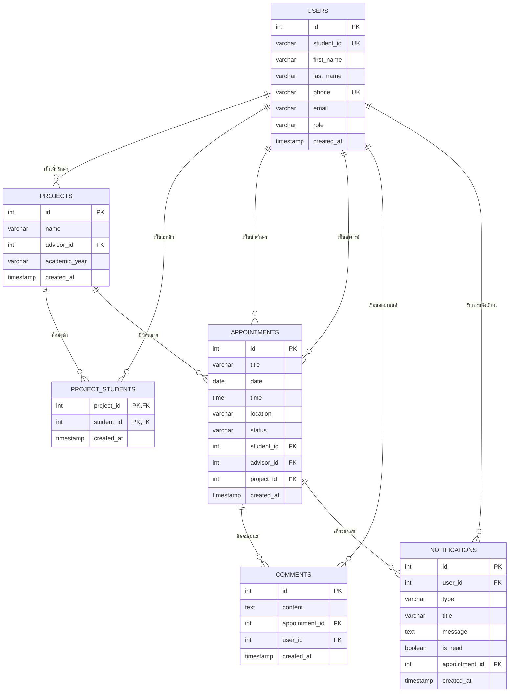

# ER Diagram - Simple Version

## 📊 **Entity Relationship Diagram**

## 🔗 **ความสัมพันธ์หลัก**

1. **USERS → PROJECTS** (1:Many) - อาจารย์เป็นที่ปรึกษาโปรเจค
2. **USERS ↔ PROJECTS** (Many:Many) - นักศึกษาในโปรเจค (ผ่าน PROJECT_STUDENTS)
3. **USERS → APPOINTMENTS** (1:Many) - นักศึกษา/อาจารย์ในนัดหมาย
4. **PROJECTS → APPOINTMENTS** (1:Many) - โปรเจคมีนัดหมาย
5. **APPOINTMENTS → COMMENTS** (1:Many) - นัดหมายมีคอมเมนต์
6. **USERS → NOTIFICATIONS** (1:Many) - ผู้ใช้รับการแจ้งเตือน

## 📋 **สัญลักษณ์**

- **PK** = Primary Key
- **FK** = Foreign Key  
- **UK** = Unique Key
- **||--o{** = One-to-Many
- **}o--||** = Many-to-One
