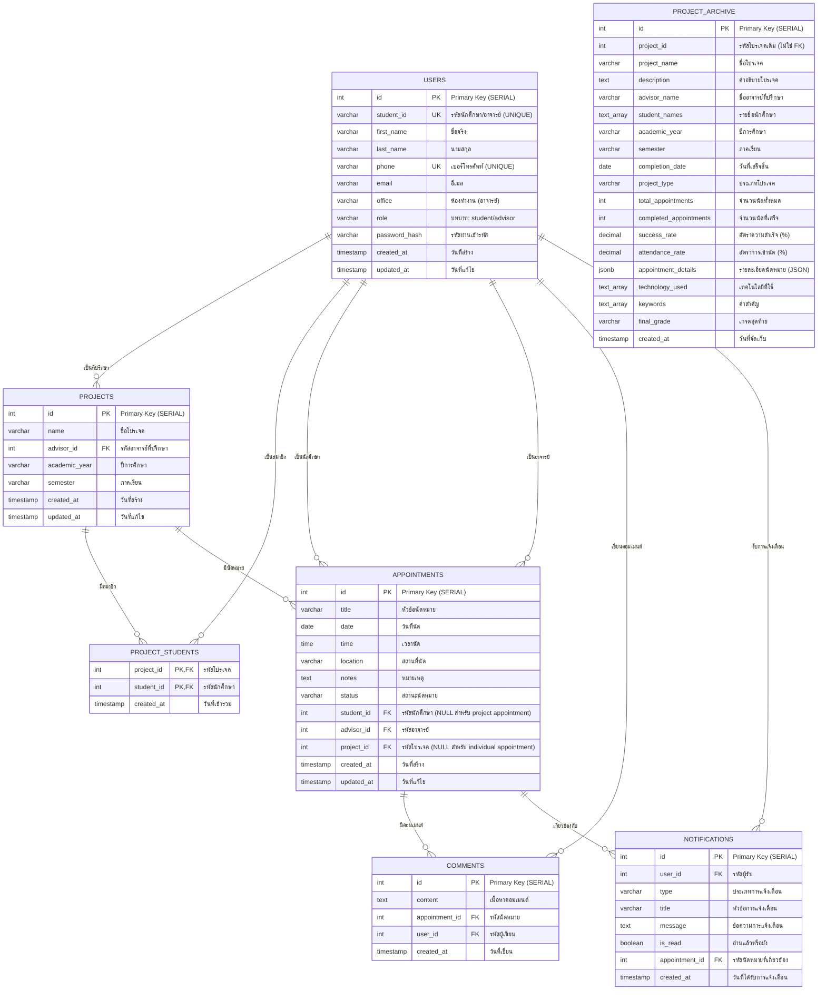

# ER Diagram (Entity Relationship Diagram)
## ระบบจัดการนัดหมาย - Appointment Management System

---

## 📊 **ER Diagram**



---

## 🔗 **อธิบายความสัมพันธ์ (Relationships)**

### **1. USERS ↔ PROJECTS (One-to-Many)**
```
USERS (1) ----< PROJECTS (Many)
```
- **ความสัมพันธ์**: อาจารย์ 1 คน สามารถเป็นที่ปรึกษาได้หลายโปรเจค
- **Foreign Key**: `projects.advisor_id` → `users.id`
- **Constraint**: `ON DELETE CASCADE` (ลบอาจารย์ → ลบโปรเจค)
- **ตัวอย่าง**: อาจารย์ A เป็นที่ปรึกษาโปรเจค 1, 2, 3

### **2. USERS ↔ PROJECT_STUDENTS ↔ PROJECTS (Many-to-Many)**
```
USERS (Many) ----< PROJECT_STUDENTS >---- PROJECTS (Many)
```
- **ความสัมพันธ์**: นักศึกษา 1 คน อยู่ในได้หลายโปรเจค, โปรเจค 1 โปรเจค มีได้หลายนักศึกษา
- **Junction Table**: `project_students`
- **Composite Primary Key**: `(project_id, student_id)`
- **Foreign Keys**: 
  - `project_students.project_id` → `projects.id`
  - `project_students.student_id` → `users.id`
- **Constraint**: `ON DELETE CASCADE` ทั้งคู่
- **ตัวอย่าง**: นักศึกษา A อยู่ในโปรเจค 1, 2 และโปรเจค 1 มีนักศึกษา A, B, C

### **3. USERS ↔ APPOINTMENTS (One-to-Many) - Student**
```
USERS (1) ----< APPOINTMENTS (Many)
```
- **ความสัมพันธ์**: นักศึกษา 1 คน สามารถมีได้หลายนัดหมาย
- **Foreign Key**: `appointments.student_id` → `users.id`
- **Constraint**: `ON DELETE CASCADE`
- **หมายเหตุ**: `student_id` อาจเป็น NULL สำหรับ project appointment
- **ตัวอย่าง**: นักศึกษา A มีนัดหมาย 1, 2, 3

### **4. USERS ↔ APPOINTMENTS (One-to-Many) - Advisor**
```
USERS (1) ----< APPOINTMENTS (Many)
```
- **ความสัมพันธ์**: อาจารย์ 1 คน สามารถมีได้หลายนัดหมาย
- **Foreign Key**: `appointments.advisor_id` → `users.id`
- **Constraint**: `ON DELETE CASCADE`
- **ตัวอย่าง**: อาจารย์ B มีนัดหมาย 1, 2, 3, 4

### **5. PROJECTS ↔ APPOINTMENTS (One-to-Many)**
```
PROJECTS (1) ----< APPOINTMENTS (Many)
```
- **ความสัมพันธ์**: โปรเจค 1 โปรเจค สามารถมีได้หลายนัดหมาย
- **Foreign Key**: `appointments.project_id` → `projects.id`
- **Constraint**: `ON DELETE SET NULL` (ลบโปรเจค → set project_id เป็น NULL)
- **หมายเหตุ**: `project_id` อาจเป็น NULL สำหรับ individual appointment
- **ตัวอย่าง**: โปรเจค 1 มีนัดหมาย 1, 2, 3

### **6. APPOINTMENTS ↔ COMMENTS (One-to-Many)**
```
APPOINTMENTS (1) ----< COMMENTS (Many)
```
- **ความสัมพันธ์**: นัดหมาย 1 นัด สามารถมีได้หลายคอมเมนต์
- **Foreign Key**: `comments.appointment_id` → `appointments.id`
- **Constraint**: `ON DELETE CASCADE`
- **ตัวอย่าง**: นัดหมาย 1 มีคอมเมนต์ A, B, C

### **7. USERS ↔ COMMENTS (One-to-Many)**
```
USERS (1) ----< COMMENTS (Many)
```
- **ความสัมพันธ์**: ผู้ใช้ 1 คน สามารถเขียนได้หลายคอมเมนต์
- **Foreign Key**: `comments.user_id` → `users.id`
- **Constraint**: `ON DELETE CASCADE`
- **ตัวอย่าง**: นักศึกษา A เขียนคอมเมนต์ 1, 2, 3

### **8. USERS ↔ NOTIFICATIONS (One-to-Many)**
```
USERS (1) ----< NOTIFICATIONS (Many)
```
- **ความสัมพันธ์**: ผู้ใช้ 1 คน สามารถรับได้หลายการแจ้งเตือน
- **Foreign Key**: `notifications.user_id` → `users.id`
- **Constraint**: `ON DELETE CASCADE`
- **ตัวอย่าง**: นักศึกษา A รับการแจ้งเตือน 1, 2, 3, 4

### **9. APPOINTMENTS ↔ NOTIFICATIONS (One-to-Many)**
```
APPOINTMENTS (1) ----< NOTIFICATIONS (Many)
```
- **ความสัมพันธ์**: นัดหมาย 1 นัด สามารถสร้างได้หลายการแจ้งเตือน
- **Foreign Key**: `notifications.appointment_id` → `appointments.id`
- **Constraint**: `ON DELETE CASCADE`
- **ตัวอย่าง**: นัดหมาย 1 สร้างการแจ้งเตือน A, B (ให้ student และ advisor)

---

## 📋 **สรุปความสัมพันธ์ทั้งหมด**

| # | Entity A | Relationship | Entity B | Type | FK Location | Constraint |
|---|----------|--------------|----------|------|-------------|------------|
| 1 | **USERS** | เป็นที่ปรึกษา | **PROJECTS** | 1:Many | `projects.advisor_id` | CASCADE |
| 2 | **USERS** | เป็นสมาชิก | **PROJECT_STUDENTS** | Many:Many | `project_students.student_id` | CASCADE |
| 3 | **PROJECTS** | มีสมาชิก | **PROJECT_STUDENTS** | Many:Many | `project_students.project_id` | CASCADE |
| 4 | **USERS** | เป็นนักศึกษา | **APPOINTMENTS** | 1:Many | `appointments.student_id` | CASCADE |
| 5 | **USERS** | เป็นอาจารย์ | **APPOINTMENTS** | 1:Many | `appointments.advisor_id` | CASCADE |
| 6 | **PROJECTS** | มีนัดหมาย | **APPOINTMENTS** | 1:Many | `appointments.project_id` | SET NULL |
| 7 | **APPOINTMENTS** | มีคอมเมนต์ | **COMMENTS** | 1:Many | `comments.appointment_id` | CASCADE |
| 8 | **USERS** | เขียนคอมเมนต์ | **COMMENTS** | 1:Many | `comments.user_id` | CASCADE |
| 9 | **USERS** | รับการแจ้งเตือน | **NOTIFICATIONS** | 1:Many | `notifications.user_id` | CASCADE |
| 10 | **APPOINTMENTS** | เกี่ยวข้องกับ | **NOTIFICATIONS** | 1:Many | `notifications.appointment_id` | CASCADE |

---

## 🎯 **ความสัมพันธ์พิเศษ**

### **1. Many-to-Many (Junction Table)**
- **USERS ↔ PROJECTS** ผ่าน `PROJECT_STUDENTS`
- ใช้ **Composite Primary Key** `(project_id, student_id)`
- ป้องกันการเพิ่มนักศึกษาซ้ำในโปรเจคเดียวกัน

### **2. Optional Relationships (NULL Values)**
- **APPOINTMENTS.student_id** = NULL → Project Appointment (นัดหมายทั้งโปรเจค)
- **APPOINTMENTS.project_id** = NULL → Individual Appointment (นัดหมายเฉพาะคน)

### **3. Cascade Behaviors**
- **CASCADE**: ลบ parent → ลบ children อัตโนมัติ
- **SET NULL**: ลบ parent → set foreign key เป็น NULL

### **4. Archive Relationship**
- **PROJECT_ARCHIVE** ไม่มี Foreign Key relationships
- เป็น **Independent Archive** (snapshot data)
- เก็บข้อมูลแยกจากตารางหลัก

---

## 🔄 **Data Flow Patterns**

### **1. User Registration Flow**
```
USERS → (สร้าง account) → PROJECTS → (เพิ่มสมาชิก) → PROJECT_STUDENTS
```

### **2. Appointment Creation Flow**
```
USERS → (สร้างนัดหมาย) → APPOINTMENTS → (ส่งการแจ้งเตือน) → NOTIFICATIONS
```

### **3. Appointment Interaction Flow**
```
APPOINTMENTS → (เพิ่มคอมเมนต์) → COMMENTS
APPOINTMENTS → (เปลี่ยนสถานะ) → NOTIFICATIONS
```

### **4. Project Completion Flow**
```
PROJECTS → (เสร็จสิ้น) → PROJECT_ARCHIVE (เก็บสถิติ)
```

---

## 📊 **Cardinality Summary**

| Entity | Min | Max | Description |
|--------|-----|-----|-------------|
| **USERS** | 0 | ∞ | ผู้ใช้สามารถมีได้หลาย roles และ relationships |
| **PROJECTS** | 0 | ∞ | โปรเจคต้องมี advisor 1 คน, students หลายคน |
| **APPOINTMENTS** | 0 | ∞ | นัดหมายต้องมี advisor 1 คน, student 0-1 คน |
| **COMMENTS** | 0 | ∞ | คอมเมนต์ต้องมี appointment 1 นัด, user 1 คน |
| **NOTIFICATIONS** | 0 | ∞ | การแจ้งเตือนต้องมี user 1 คน, appointment 0-1 นัด |

---

**สร้างโดย**: Appointment Management System  
**วันที่**: 2024-10-11  
**Database**: PostgreSQL 14+  
**Encoding**: UTF-8 (รองรับภาษาไทย)
