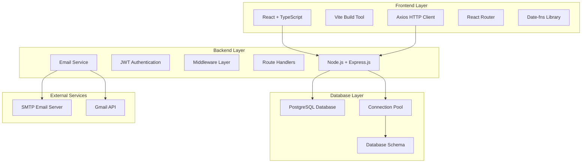
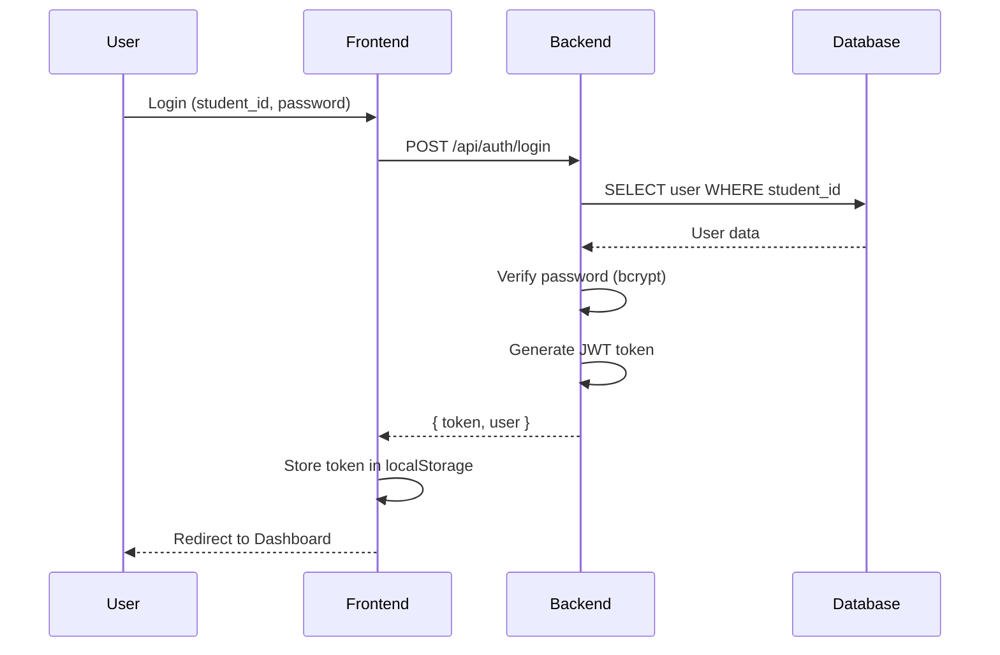
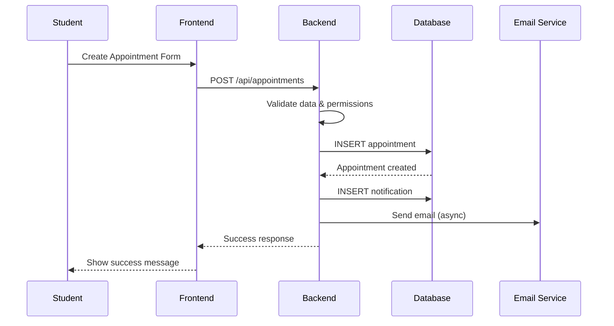
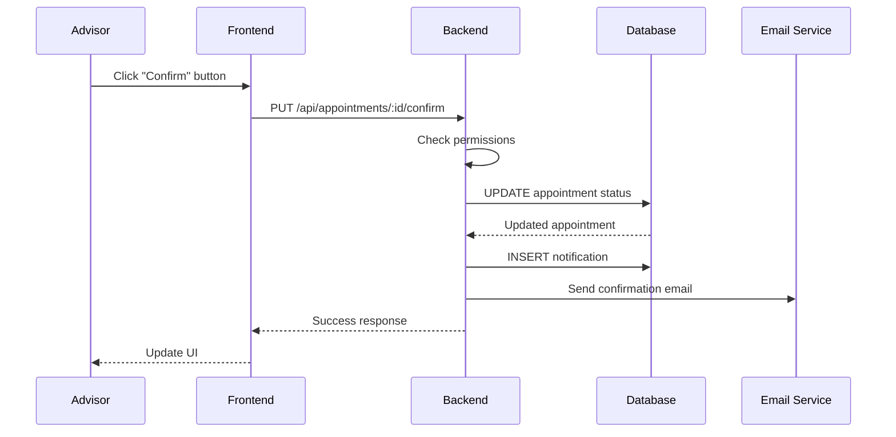
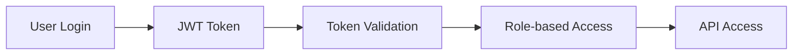
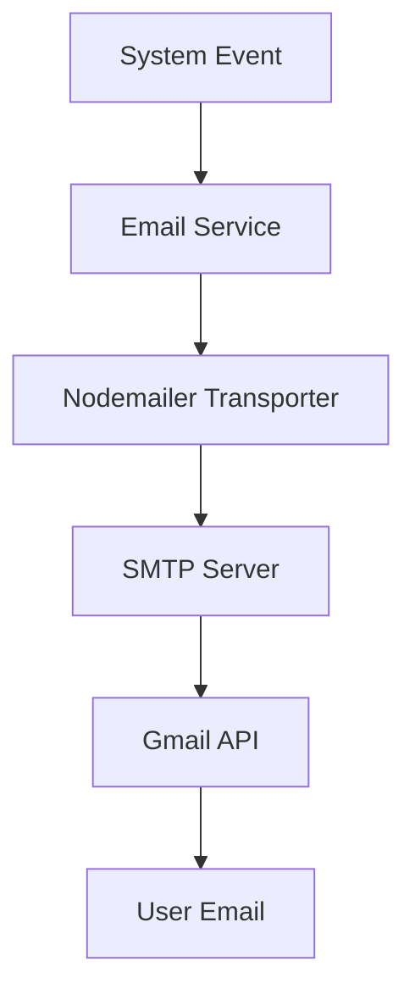

# สถาปัตยกรรมระบบ (System Architecture)
## ระบบจัดการนัดหมาย - Appointment Management System

---

## 🏗️ **ภาพรวมสถาปัตยกรรมระบบ**



---

## 📋 **สถาปัตยกรรมแบบ Layered Architecture**

### **1. Presentation Layer (Frontend)**
```
┌─────────────────────────────────────┐
│           React Frontend            │
├─────────────────────────────────────┤
│ • React 18 + TypeScript             │
│ • Vite (Build Tool)                 │
│ • React Router (Navigation)         │
│ • Axios (HTTP Client)               │
│ • Date-fns (Date Handling)          │
│ • Tailwind CSS (Styling)            │
└─────────────────────────────────────┘
```

### **2. Application Layer (Backend)**
```
┌─────────────────────────────────────┐
│         Node.js Backend             │
├─────────────────────────────────────┤
│ • Express.js (Web Framework)        │
│ • JWT Authentication                │
│ • Middleware (Auth, CORS, etc.)     │
│ • Route Handlers                    │
│ • Email Service (Nodemailer)        │
│ • Error Handling                    │
└─────────────────────────────────────┘
```

### **3. Data Layer (Database)**
```
┌─────────────────────────────────────┐
│        PostgreSQL Database          │
├─────────────────────────────────────┤
│ • Relational Database               │
│ • Connection Pooling                │
│ • ACID Transactions                 │
│ • Foreign Key Constraints           │
│ • Triggers & Functions              │
└─────────────────────────────────────┘
```

---

## 🔄 **การทำงานของระบบ (System Workflow)**

### **1. User Authentication Flow**


### **2. Appointment Creation Flow**


### **3. Appointment Status Update Flow**


---

## 🏛️ **สถาปัตยกรรมแบบ MVC Pattern**

### **Model (Data Layer)**
```javascript
// Database Models
- Users Model
- Projects Model  
- Appointments Model
- Comments Model
- Notifications Model
- Project_Archive Model
```

### **View (Presentation Layer)**
```typescript
// React Components
- Dashboard.tsx
- Appointments.tsx
- Projects.tsx
- Notifications.tsx
- Login.tsx
- Profile.tsx
```

### **Controller (Business Logic Layer)**
```javascript
// Express Route Handlers
- /api/users/* (User management)
- /api/projects/* (Project management)
- /api/appointments/* (Appointment management)
- /api/notifications/* (Notification management)
- /api/comments/* (Comment management)
```

---

## 🔧 **เทคโนโลยีที่ใช้ (Technology Stack)**

### **Frontend Technologies**
| Technology | Version | Purpose |
|------------|---------|---------|
| **React** | 18.x | UI Framework |
| **TypeScript** | 5.x | Type Safety |
| **Vite** | 4.x | Build Tool |
| **React Router** | 6.x | Client-side Routing |
| **Axios** | 1.x | HTTP Client |
| **Date-fns** | 2.x | Date Manipulation |
| **Tailwind CSS** | 3.x | CSS Framework |

### **Backend Technologies**
| Technology | Version | Purpose |
|------------|---------|---------|
| **Node.js** | 18.x | Runtime Environment |
| **Express.js** | 4.x | Web Framework |
| **PostgreSQL** | 14+ | Database |
| **JWT** | 9.x | Authentication |
| **bcrypt** | 5.x | Password Hashing |
| **Nodemailer** | 6.x | Email Service |
| **CORS** | 2.x | Cross-Origin Requests |

### **Development Tools**
| Tool | Purpose |
|------|---------|
| **Git** | Version Control |
| **npm** | Package Manager |
| **ESLint** | Code Linting |
| **Prettier** | Code Formatting |
| **VS Code** | IDE |

---

## 🗄️ **Database Architecture**

### **Database Design Principles**
- **Normalization**: 3NF (Third Normal Form)
- **ACID Properties**: Atomicity, Consistency, Isolation, Durability
- **Referential Integrity**: Foreign Key Constraints
- **Data Validation**: Check Constraints, NOT NULL
- **Performance**: Indexes on frequently queried columns

### **Connection Management**
```javascript
// Connection Pool Configuration
const pool = new Pool({
  host: process.env.DB_HOST,
  port: process.env.DB_PORT,
  database: process.env.DB_NAME,
  user: process.env.DB_USER,
  password: process.env.DB_PASSWORD,
  max: 20, // Maximum connections
  idleTimeoutMillis: 30000,
  connectionTimeoutMillis: 2000,
});
```

---

## 🔐 **Security Architecture**

### **Authentication & Authorization**


### **Security Measures**
1. **JWT Authentication**: Stateless token-based auth
2. **Password Hashing**: bcrypt with salt rounds
3. **CORS Protection**: Configured for specific origins
4. **Input Validation**: Server-side validation
5. **SQL Injection Prevention**: Parameterized queries
6. **Rate Limiting**: Prevent brute force attacks

### **Role-based Access Control (RBAC)**
```javascript
// User Roles
- 'student': Can create appointments, view own data
- 'advisor': Can manage projects, confirm/reject appointments
- 'admin': Full system access (future implementation)
```

---

## 📧 **Email Service Architecture**

### **Email Flow**


### **Email Types**
- **Appointment Created**: New appointment notification
- **Appointment Confirmed**: Confirmation notification
- **Appointment Rejected**: Rejection notification
- **Appointment Updated**: Change notification
- **Appointment Reminder**: Upcoming appointment alert

---

## 🚀 **Deployment Architecture**

### **Development Environment**
```
┌─────────────────┐    ┌─────────────────┐    ┌─────────────────┐
│   Frontend      │    │    Backend      │    │   Database      │
│   (Vite Dev)    │◄──►│  (Node.js Dev)  │◄──►│  (PostgreSQL)   │
│   Port: 5173    │    │   Port: 3001    │    │   Port: 5432    │
└─────────────────┘    └─────────────────┘    └─────────────────┘
```

### **Production Environment (Recommended)**
```
┌─────────────────┐    ┌─────────────────┐    ┌─────────────────┐
│   Frontend      │    │    Backend      │    │   Database      │
│   (Static Host) │◄──►│  (Node.js App)  │◄──►│  (PostgreSQL)   │
│   (Vercel/Netlify)│   │  (Railway/Heroku)│   │  (Railway/Supabase)│
└─────────────────┘    └─────────────────┘    └─────────────────┘
```

---

## 📊 **Performance Considerations**

### **Frontend Optimization**
- **Code Splitting**: Lazy loading components
- **Bundle Optimization**: Vite build optimization
- **Caching**: Browser caching for static assets
- **Image Optimization**: Compressed images

### **Backend Optimization**
- **Database Indexing**: Indexes on frequently queried columns
- **Connection Pooling**: Reuse database connections
- **Async Operations**: Non-blocking email sending
- **Query Optimization**: Efficient SQL queries with JOINs

### **Database Optimization**
```sql
-- Key Indexes
CREATE INDEX idx_users_student_id ON users(student_id);
CREATE INDEX idx_appointments_date ON appointments(date);
CREATE INDEX idx_appointments_status ON appointments(status);
CREATE INDEX idx_notifications_user_id ON notifications(user_id);
```

---

## 🔄 **Data Flow Architecture**

### **1. User Registration Flow**
```
User Input → Frontend Validation → API Call → Backend Validation → Database Insert → Response
```

### **2. Appointment Management Flow**
```
Create → Validate → Store → Notify → Email → Update UI
```

### **3. Notification Flow**
```
Event Trigger → Create Notification → Store in DB → Display in UI → Mark as Read
```

---

## 🛠️ **Development Workflow**

### **1. Local Development Setup**
```bash
# Backend
cd backend
npm install
npm run dev

# Frontend  
cd frontend
npm install
npm run dev
```

### **2. Code Organization**
```
appointmentproject/
├── backend/
│   ├── routes/          # API routes
│   ├── middleware/      # Authentication, validation
│   ├── services/        # Business logic
│   ├── config/          # Database, email config
│   └── database/        # SQL scripts
├── src/
│   ├── pages/           # React pages
│   ├── components/      # Reusable components
│   ├── services/        # API calls
│   ├── types/           # TypeScript types
│   └── utils/           # Helper functions
└── docs/                # Documentation
```

---

## 📈 **Scalability Considerations**

### **Horizontal Scaling**
- **Load Balancer**: Distribute requests across multiple servers
- **Database Replication**: Read replicas for better performance
- **CDN**: Content delivery network for static assets

### **Vertical Scaling**
- **Server Resources**: Increase CPU, RAM, storage
- **Database Optimization**: Better indexing, query optimization
- **Caching**: Redis for session storage and caching

---

## 🔍 **Monitoring & Logging**

### **Application Monitoring**
- **Error Tracking**: Console.error for debugging
- **Performance Monitoring**: Response time tracking
- **User Activity**: Login/logout tracking

### **Database Monitoring**
- **Query Performance**: Slow query logging
- **Connection Monitoring**: Active connections tracking
- **Storage Monitoring**: Database size monitoring

---

## 🎯 **System Requirements**

### **Minimum Requirements**
- **Node.js**: 18.x or higher
- **PostgreSQL**: 14.x or higher
- **RAM**: 4GB minimum
- **Storage**: 10GB available space

### **Recommended Requirements**
- **Node.js**: 20.x LTS
- **PostgreSQL**: 15.x
- **RAM**: 8GB or higher
- **Storage**: 50GB SSD

---

**สร้างโดย**: Appointment Management System  
**วันที่**: 2024-10-11  
**เวอร์ชัน**: 1.0.0  
**สถาปัตยกรรม**: Layered Architecture + MVC Pattern
